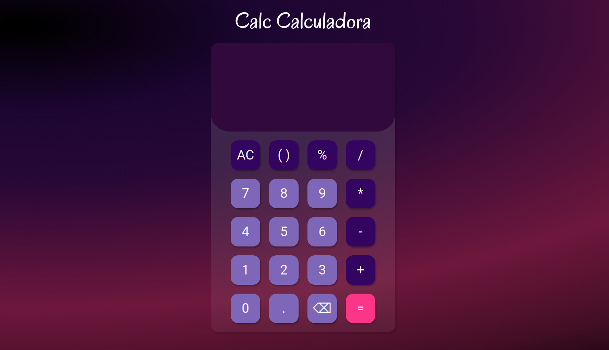

# Calc Calculadora

É um projeto pessoal de uma calculadora básica, que pode ser usada em qualquer dispositivo.

## Screenshots

## Stack Utilizada

Front-end: HTML, CSS e Javascript

## Objetivo

O intuito desse projeto é de treinar Javascript e lógica de programação.
## Funcionalidade

- Faz cálculos basicos e de média complexidade;
- Calcula porcentagem apenas utilizando o sinal % ex: 10%300;
- Define a ordem de cálculo de uma expressão através de parênteses;
- Responsividade.

## Aprendizados
 
 * Desenvolvimento da lógica de programação;
 * Utilização de métodos de arrays e strings;
 * Manipulação do DOM
 * Organização de arquivos.

## Link do projeto

Você pode acessar e interagir com o projeto clicando [aqui](https://calccalculadora-mariag.netlify.app/).